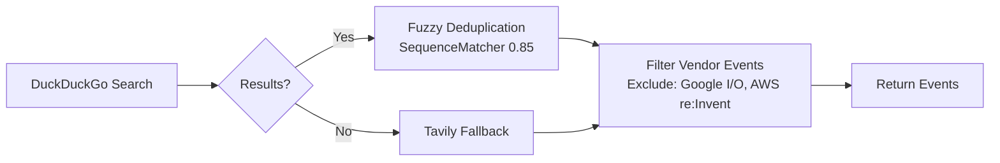
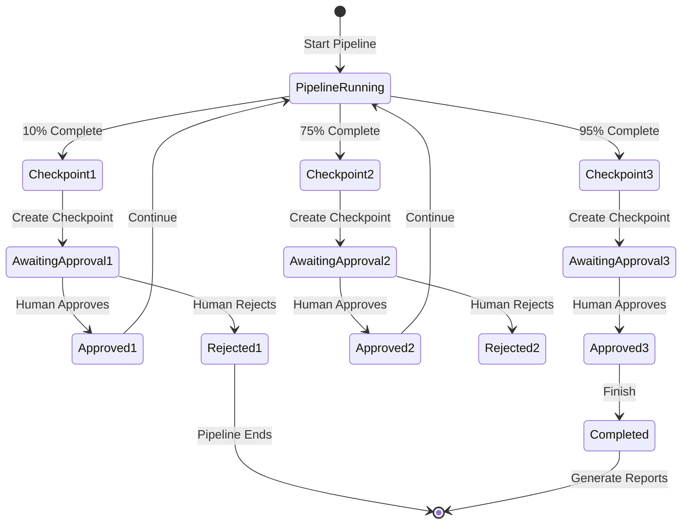
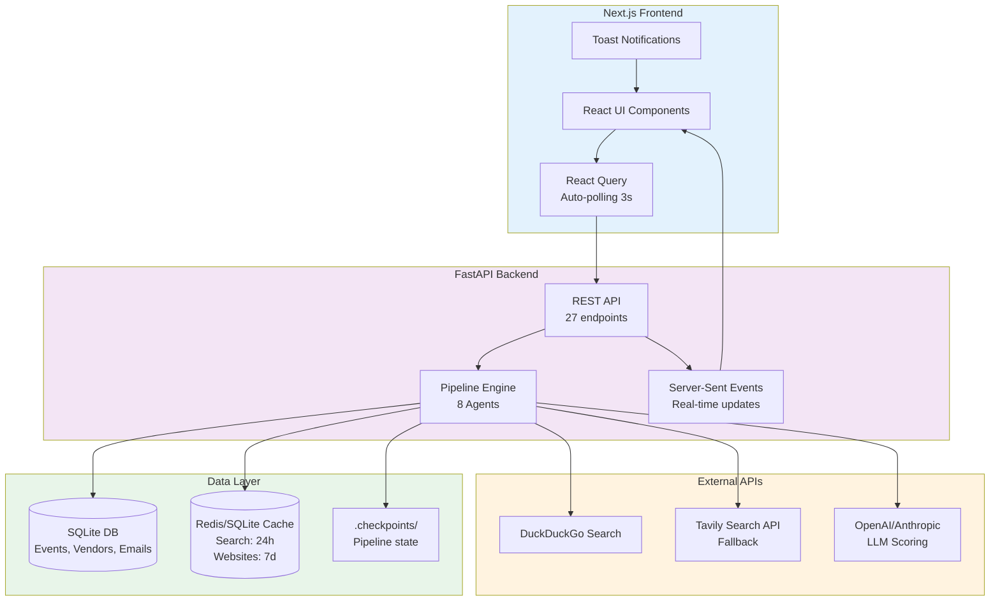
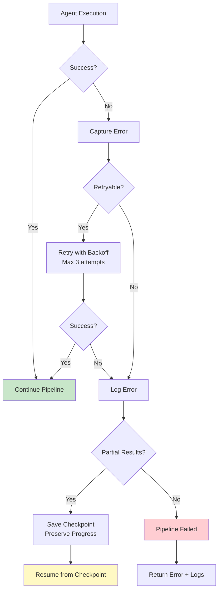

# Marketing Agents - Agentic Workflow Diagram

## Complete Pipeline Flow

```mermaid
flowchart TB
    subgraph Input["📥 Input Layer"]
        User[User Query<br/>e.g., "fintech conferences 2026"]
        Config[Configuration<br/>Industry, Region, Checkpoints]
    end

    subgraph Pipeline["🔄 Agent Pipeline"]
        direction TB
        
        A0["**Agent 0: Schema Init**<br/>📋 Validates config & creates pipeline context"]
        
        A1["**Agent 1: Event Discovery**<br/>🔍 DuckDuckGo search + deduplication<br/>⏱️ Progress: 0% → 10%"]
        
        CP1["**🚦 Checkpoint 1: Event Review**<br/>Human approves discovered events<br/>Status: pending → approved/rejected<br/>⏱️ Progress: 10% → 25%"]
        
        A2["**Agent 2: Event Qualification**<br/>✅ Filters by relevance, location, date<br/>Removes vendor-specific events<br/>⏱️ Progress: 25% → 35%"]
        
        A3["**Agent 3: Website Scraping**<br/>🌐 BeautifulSoup extraction<br/>Gets: dates, location, speakers, sponsors<br/>⏱️ Progress: 35% → 50%"]
        
        A4["**Agent 4: Intelligence Gathering**<br/>🧠 Analyzes: audience, competitors, themes<br/>LLM-based insights<br/>⏱️ Progress: 50% → 60%"]
        
        A5["**Agent 5: Prioritization**<br/>📊 100-point scoring rubric:<br/>• Audience Quality (25 pts)<br/>• Reputation (20 pts)<br/>• ROI Potential (20 pts)<br/>• Strategic Fit (15 pts)<br/>• Geographic (10 pts)<br/>• Competitive (10 pts)<br/>⏱️ Progress: 60% → 75%"]
        
        CP2["**🚦 Checkpoint 2: Vendor Review**<br/>Human reviews vendor list<br/>⏱️ Progress: 75% → 80%"]
        
        A6["**Agent 6: Vendor Discovery**<br/>🏢 Finds: sponsors, exhibitors, partners<br/>Links vendors to events<br/>⏱️ Progress: 80% → 85%"]
        
        A7["**Agent 7: Outreach Email**<br/>✉️ Personalized email generation<br/>Gmail draft integration<br/>⏱️ Progress: 85% → 95%"]
        
        CP3["**🚦 Checkpoint 3: Email Review**<br/>Human approves email drafts<br/>⏱️ Progress: 95% → 98%"]
        
        A8["**Agent 8: Report Generation**<br/>📄 Markdown reports + Excel export<br/>⏱️ Progress: 98% → 100%"]
    end

    subgraph Output["📤 Output Layer"]
        Events[(SQLite Database<br/>Events, Vendors, Emails)]
        Reports[📊 Reports<br/>• Event Summary<br/>• Vendor Analysis<br/>• Outreach Tracking]
        Excel["📁 Excel Export<br/>events_export.xlsx"]
    end

    subgraph Monitoring["📊 Monitoring & Reliability"]
        direction TB
        Health[Health Checks<br/>✓ Database<br/>✓ APIs<br/>✓ Pipeline]
        Metrics[Prometheus Metrics<br/>• Events discovered<br/>• Agent latency<br/>• Success rates]
        Logs[Structured Logging<br/>Correlation IDs<br/>Log Viewer UI]
        Retry[Retry Logic<br/>3 retries, exponential backoff]
        Circuit[Circuit Breaker<br/>Prevents cascade failures]
        Cache[SQLite Cache<br/>Search: 24h<br/>Websites: 7d]
    end

    %% Flow connections
    User --> A0
    Config --> A0
    A0 --> A1
    A1 --> CP1
    CP1 -->|Approved| A2
    CP1 -->|Rejected| End1[(Pipeline Ends)]
    A2 --> A3
    A3 --> A4
    A4 --> A5
    A5 --> CP2
    CP2 -->|Approved| A6
    A6 --> A7
    A7 --> CP3
    CP3 -->|Approved| A8
    A8 --> Events
    A8 --> Reports
    A8 --> Excel

    %% Monitoring connections
    A1 -.-> Cache
    A3 -.-> Cache
    A1 -.-> Retry
    A3 -.-> Retry
    Pipeline -.-> Health
    Pipeline -.-> Metrics
    Pipeline -.-> Logs
    A1 -.-> Circuit
    A3 -.-> Circuit

    style Input fill:#e1f5fe
    style Pipeline fill:#f3e5f5
    style Output fill:#e8f5e9
    style Monitoring fill:#fff3e0
    style CP1 fill:#ffebee
    style CP2 fill:#ffebee
    style CP3 fill:#ffebee
```

## Detailed Agent Breakdown

### Agent 0: Schema Initialization
**Purpose:** Validates configuration and creates pipeline context
**Input:** User query, industry, region, checkpoint settings
**Output:** Pipeline context object with metadata
**Key Features:**
- Pydantic validation
- Correlation ID generation
- Config normalization

---

### Agent 1: Event Discovery
**Purpose:** Finds industry events using web search
**Input:** Query string, filters
**Output:** List of raw events (10-50 events)
**Process:**

**Reliability:** 
- 3 retries with exponential backoff
- Circuit breaker for search APIs
- SQLite cache (24h TTL)

---

### Agent 2: Event Qualification
**Purpose:** Filters events by business relevance
**Input:** Raw events list
**Output:** Qualified events (filtered list)
**Filters Applied:**
- Date range (future events only)
- Location relevance
- Industry match
- Event type (exclude vendor conferences)
- Size/scale thresholds

---

### Agent 3: Website Scraping
**Purpose:** Extracts detailed event information
**Input:** Event websites (URLs)
**Output:** Enriched events with:
- Exact dates & venue
- Speaker lists
- Sponsor/exhibitor lists
- Pricing info
- Agenda highlights
**Tech:** BeautifulSoup + httpx
**Rate Limiting:** 1 req/sec with retry

---

### Agent 4: Intelligence Gathering
**Purpose:** AI-powered analysis of events
**Input:** Scraped event data
**Output:** Strategic insights
**Analysis:**
- Audience quality assessment
- Competitive landscape
- Technology themes
- Past attendee companies
- Strategic value scoring
**Model:** GPT-based analysis with structured output

---

### Agent 5: Prioritization (100-Point Rubric)
**Purpose:** Score and rank events objectively

| Criterion | Points | Description |
|-----------|--------|-------------|
| **Audience Quality** | 25 | Decision-makers, seniority, company size |
| **Event Reputation** | 20 | Past attendance, speaker quality, reviews |
| **ROI Potential** | 20 | Lead quality, deal size potential |
| **Strategic Fit** | 15 | Alignment with product roadmap |
| **Geographic Importance** | 10 | Regional market priority |
| **Competitive Presence** | 10 | Competitor sponsorship/attendance |

**Output:** Tier classification (S, A, B, C)

---

### Agent 6: Vendor Discovery
**Purpose:** Find sponsorship/exhibition opportunities
**Input:** Qualified events
**Output:** Vendor lists per event
**Sources:**
- Event website "sponsors" pages
- LinkedIn company lists
- Past exhibitor databases
**Data Captured:**
- Company name & website
- Contact email/LinkedIn
- Vendor type (sponsor/exhibitor/partner)
- Relevance score (0-100)

---

### Agent 7: Outreach Email
**Purpose:** Generate personalized outreach
**Input:** Event + vendor data
**Output:** Email drafts
**Personalization Factors:**
- Event theme alignment
- Vendor's past sponsorships
- Mutual connections
- Value proposition tailoring
**Integration:** Saves to Gmail drafts via MCP

---

### Agent 8: Report Generation
**Purpose:** Create deliverables
**Formats:**
- Markdown executive summary
- Detailed vendor analysis
- Email tracking report
- Excel export (events, vendors, emails)

---

## Human Checkpoints System



---

## Data Flow Architecture



---

## Error Handling & Recovery



---

## Technology Stack

| Layer | Technology |
|-------|------------|
| **Frontend** | Next.js 16, React, TypeScript, Tailwind CSS, Heroicons |
| **State Management** | TanStack Query (React Query), React Hot Toast |
| **Backend** | FastAPI, Python 3.11, Pydantic |
| **Database** | SQLite (persistent storage) |
| **Caching** | SQLite (TTL-based) |
| **Monitoring** | Prometheus metrics, structured logging |
| **Search** | DuckDuckGo (primary), Tavily/Serper (fallback) |
| **AI/ML** | OpenAI GPT (scoring, intelligence) |
| **Web Scraping** | BeautifulSoup, httpx |
| **Testing** | pytest (174 tests) |

---

## Current Status

✅ **Completed:**
- All 8 agents implemented
- 23 reliability improvements
- Next.js frontend with 8 pages
- FastAPI backend with 27 endpoints
- Log viewer system
- Human checkpoint workflow
- Toast notifications & auto-polling

🔧 **In Progress:**
- Fix checkpoint filename bug (causing 25% failure)

📋 **Pending:**
- Full pipeline end-to-end testing
- Production deployment setup
